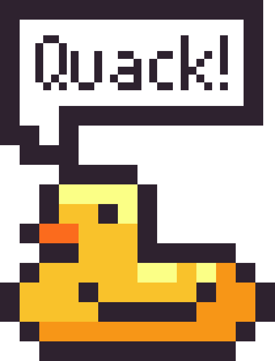

    

# Rubber Ducking

https://github.com/user-attachments/assets/0c397679-b372-4bda-be8e-638ab7b99852

It's a Duck that helps you out!

Basically is a method of debugging code by articulating a problem in spoken or written natural language [more info](https://en.wikipedia.org/wiki/Rubber_duck_debugging).

I also want to extend that by making it useful not just for that but for other potential day to day tasks that a Developer may want to automate like:
* Reminders
* Running scripts or tests
* Help you concentrate with Pomodoro
* Others

As at the end it's also a CLI it's pluggable to anything so the sky is the limit!.
